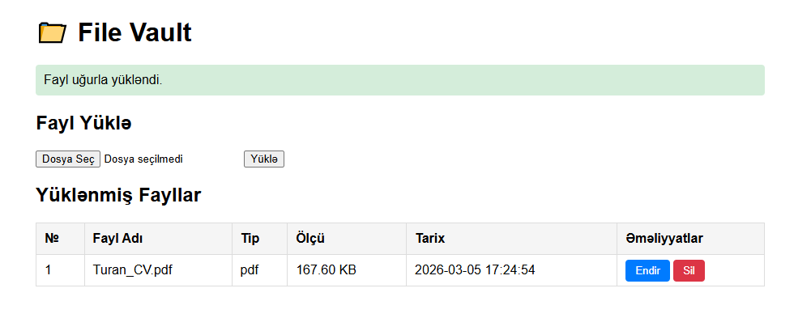

# 📁 File Vault

A simple file upload manager built with **pure PHP** (no frameworks).  
Upload, download, and delete files — with basic security and a clean structure.

---

## 🚀 Features

- Upload files (jpg, jpeg, png, pdf, docx, zip — max 5MB)
- List all uploaded files with size, type, and date
- Download files directly to your computer
- Delete files from both server and database
- XSS and SQL Injection protection

---

## 🗂️ Project Structure
```
project/
├── app/
│   ├── Controllers/FileController.php
│   ├── Models/FileModel.php
│   └── Views/files/index.php
├── config/
│   ├── database.example.php
│   └── upload.php
├── core/
│   ├── Database.php
│   ├── Router.php
│   └── helpers.php
├── migrations/
│   └── 001_create_files_table.php
├── storage/uploads/
├── public/
│   └── index.php
└── migrate.php
```

---

## ⚙️ Setup

**1. Clone the repo**
```bash
git clone https://github.com/username/file-vault.git
cd file-vault
```

**2. Configure database**
```bash
cp config/database.example.php config/database.php
```
Open `config/database.php` and fill in your credentials.

**3. Run migrations**
```bash
php migrate.php
```

**4. Start the server**
```bash
php -S localhost:8000 -t public
```

Open `http://localhost:8000` in your browser.

---

## 🖼️ Add Screenshot



---

## 🛡️ Security

- `htmlspecialchars()` — XSS protection
- PDO prepared statements — SQL Injection protection
- MIME type validation — file type spoofing protection
- `uploads/index.html` — directory listing protection

---

## 🧰 Built With

- PHP 8+
- MySQL
- Apache (.htaccess)
